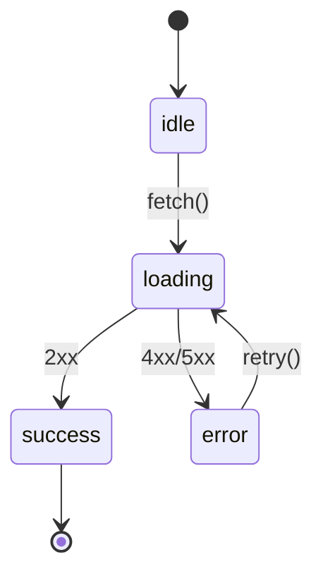

# TDD ルール (Kent Beck の Red → Green → Refactor)

このファイルは複数プロジェクトで共有される TDD ルール集。プロジェクト固有のテスト実行コマンドや
テストフレームワーク詳細は、これを `@~/.claude/templates/tdd.md` でインポートする
プロジェクト側の CLAUDE.md で定義する。

## 大原則: テストを書かずに実装コードを書かない

ユーザーから機能追加・修正の依頼を受けたら、**最初に失敗するテストを書く**。実装から始めてはいけない。
「ちょっとした修正だから」「自明だから」もテスト先行の例外にしない。

## サイクル開始前: テストリストを書き出す

機能実装に着手する前に、思いつく **テストシナリオを洗い出してチェックリスト化** する (Kent Beck の "Test List" プラクティス)。サイクル中に集中力を切らさず、頭に浮かんだ別ケースを「あとでやる」リストに退避するため。

- 場所: プロジェクトルート直下の `.tdd/` フォルダ (`.gitignore` 済み、コミット対象外)。テストリストは `.tdd/test-list.md`。
  - 初回セットアップ: インポート先プロジェクトの `.gitignore` に `.tdd/` を追加する (一度だけ)。
- 形式: Markdown のチェックリスト (`- [ ] シナリオ`)
- 運用:
  - 着手時に自分でドラフトを作る (ユーザー確認は不要、作業しながら更新する)
  - Green に到達したら該当行を `- [x]` に変える
  - 実装中に新しいシナリオを思いついたら追記する
  - 機能が完成して全項目チェック済みになったら `.tdd/` フォルダごと削除する

### (任意) 状態を持つ機能では状態遷移図を併記する

機能が以下のような **明確な状態と遷移** を持つ場合、`.tdd/state-diagram.md` に mermaid の `stateDiagram-v2` で図を書く。テストリストが「(現在状態, 入力イベント, 期待される次状態)」の形で自然に導出できるため、漏れを減らせる。

**書く価値がある例**:

- ライフサイクル系: 認証 (logged_out → logging_in → logged_in → expired)
- 非同期: idle → loading → success / error
- ウィザード / 多段フォーム
- パーサー / トークナイザ / ステートマシン
- リトライ・バックオフ・サーキットブレーカー

**書かなくてよい例** (作るとむしろ BDUF で害になる):

- 純粋関数 (計算、変換、整形、ソート等)
- 単純な CRUD で状態遷移が「存在しない / 存在する」の 2 値しかないもの

例 (非同期データフェッチ):

図を書いたら、各遷移 (矢印) ごとにテストリストへ 1 行追加する。`.tdd/state-diagram.md` も機能完成時に `.tdd/` フォルダごと削除する。

## TDD サイクル

各ステップを 1 つずつ完了させ、ステップごとに必ずテストを実行する。複数ステップをまとめて進めない。

### 1. 🔴 Red — 失敗するテストを書く

- 実装したい振る舞いを表す **最小のテスト 1 つ** を書く。
- 新しい振る舞いを駆動するテストは、実行して **意図した理由で失敗する** ことを確認してから Green に進む (コンパイルエラー / アサーション失敗)。
- まだ存在しない関数・コンポーネントへの import で落ちている段階でも「Red」と認める。
- 三角測量や保護網のテスト (既に一般化された実装に対するリグレッション防止用) は、最初からグリーンになっても許容する。

### 2. 🟢 Green — 最短でテストを通す

- テストを通す **最小限のコード** だけ書く。汚くてよい。
- 仮実装 (`return 1` のようなハードコード) で十分なら、それで通す。
- 「ついでにこっちも直そう」「もう一個メソッド足そう」を **絶対にしない**。スコープはテストが要求する範囲のみ。
- **プロジェクトのテスト実行コマンド** (プロジェクト側 CLAUDE.md の `## コマンド` を参照) でテスト全体がグリーンになることを確認する。

### 3. ♻️ Refactor — 重複と臭いを消す

- テストがグリーンの状態を保ったまま、重複除去・命名改善・抽象化を行う。
- リファクタリング中は **新しい振る舞いを足さない**。振る舞いの追加は次の Red から。
- リファクタごとにテストを走らせる。1 つでも落ちたら直前の変更を取り消す。

### 4. 次の Red へ

- 三角測量 (Triangulation): 仮実装で通したら、別の入力でもう 1 ケーステストを追加し、一般化を強制する。
- 1 サイクルが終わったらユーザーに報告し、次のテストケースを相談する (勝手に大きく進めない)。

## 振る舞いの指示

- テストを書かずに実装ファイルを編集しようとしていることに気づいたら **手を止めて** 失敗テストの作成に戻る。
- ユーザーが「実装だけ書いて」と明示的に指示した場合のみ、TDD サイクルから外れてよい (その場合も明示的に確認する)。
- 既存テストを壊す変更を加えたら、新機能の追加よりも先にレッドの解消を最優先する。
- リファクタ提案をするときは「このリファクタはグリーンを保つ」ことを根拠付きで述べる。
- 仮実装で通した時点で必ず「次は三角測量のためにどんなケースを追加しますか?」と聞く。
- Red → Green → Refactor の各遷移では **プロジェクトのテスト実行コマンド** を使う (ウォッチモードのキャッシュに惑わされないため)。
