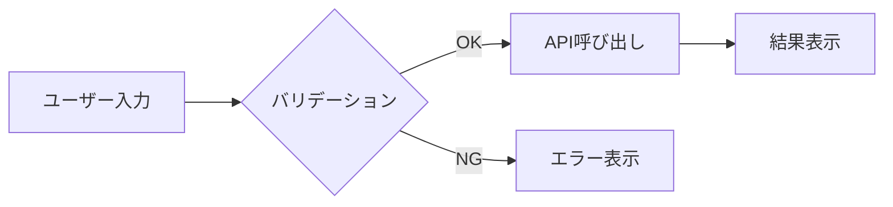

# PR Comment Skill

## 処理フロー

1. **PR情報の取得** — `gh pr view --json number,title,body` で現在のブランチに対応するPRを取得
2. **差分の取得** — `gh pr diff` または `gh pr view --json files` で変更ファイル一覧を取得
3. **変更内容の分析** — 差分を分析し、以下を特定：
   - 主な変更点（機能追加/修正/削除）
   - 影響範囲
   - 技術的なポイント
4. **説明文生成** — 下記フォーマットで説明を生成
5. **PRのDescription更新** — `gh pr edit --body` でPRのbodyを更新

## ghコマンド例

```bash
# 現在のブランチのPR情報を取得
gh pr view --json number,title,body,headRefName,baseRefName

# PR番号を指定して取得
gh pr view 123 --json number,title,body

# 変更ファイル一覧を取得
gh pr view --json files

# PRの差分を取得
gh pr diff

# PRのDescriptionを更新
gh pr edit --body "新しい説明文"

# PRのDescriptionをファイルから更新
gh pr edit --body-file description.md
```

## 重要な注意事項

- **PRのDescription（body）を更新する**: `gh pr comment` はコメント欄への投稿となるため使用しない。PR作成者としてDescriptionを更新するには `gh pr edit --body` を使用すること。
- ghコマンドは現在のブランチに対応するPRを自動検出するため、通常はPR番号の指定は不要。

## 出力フォーマット

```markdown
## 変更概要
[1-2文で変更の目的を説明]

### スクリーンショット
| Before | After |
|--------|-------|
|  |  |

> ※ UI変更がない場合は省略可

## 変更内容一覧

| ファイル | 変更種別 | 概要 |
|---------|---------|------|
| `src/components/Button.tsx` | 修正 | ボタンのスタイルを変更 |
| `src/utils/format.ts` | 追加 | 日付フォーマット関数を追加 |
| `src/old/legacy.ts` | 削除 | 未使用のレガシーコードを削除 |

## 処理フロー図



> ※ 複雑なロジック変更がある場合のみ記載

## 技術的なポイント

| 項目 | 説明 |
|------|------|
| 使用した技術 | [新たに導入した技術やライブラリ] |
| 設計判断 | [なぜこの実装方法を選んだか] |
| 注意点 | [レビュアーが知っておくべき注意点] |

## 影響範囲

| 影響箇所 | 影響度 | 説明 |
|---------|--------|------|
| ユーザー画面 | 高 | ボタンの見た目が変わる |
| API | 低 | 内部処理のみ、外部IF変更なし |

## テストチェックリスト

- [ ] ユニットテストが通ること
- [ ] 既存の機能が壊れていないこと
- [ ] 新機能が仕様通り動作すること
- [ ] エッジケースの確認
- [ ] パフォーマンスに問題がないこと
```

## コメント作成時の心構え

- **簡潔に** — 長すぎるコメントは読まれない
- **他のエンジニア視点** — 実装者でない人が理解できるか
- **重要なことを先に** — 変更概要を最初に書く
- **視覚的に** — テーブル・図を活用して理解しやすく
